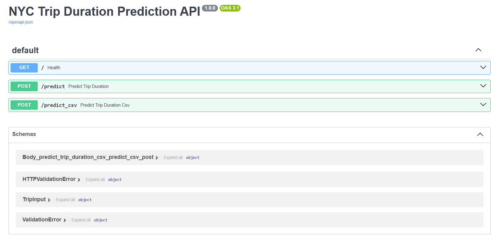
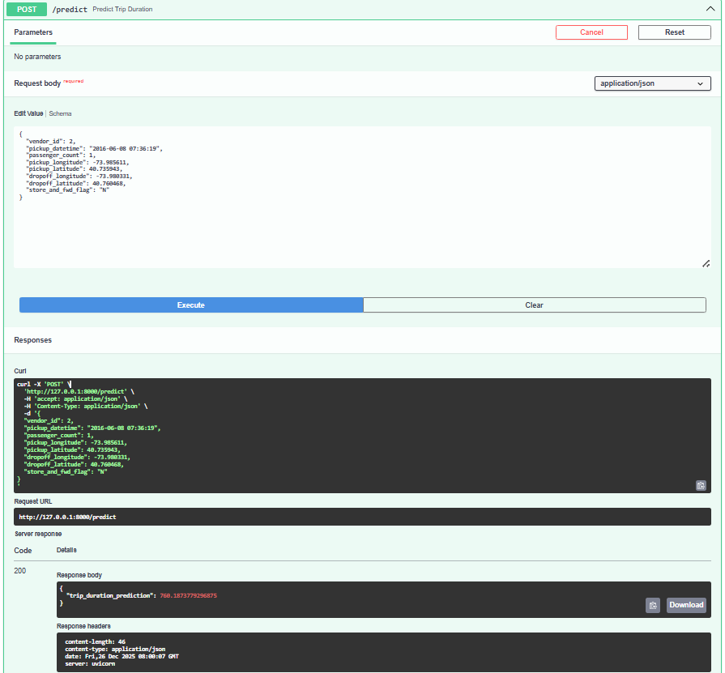
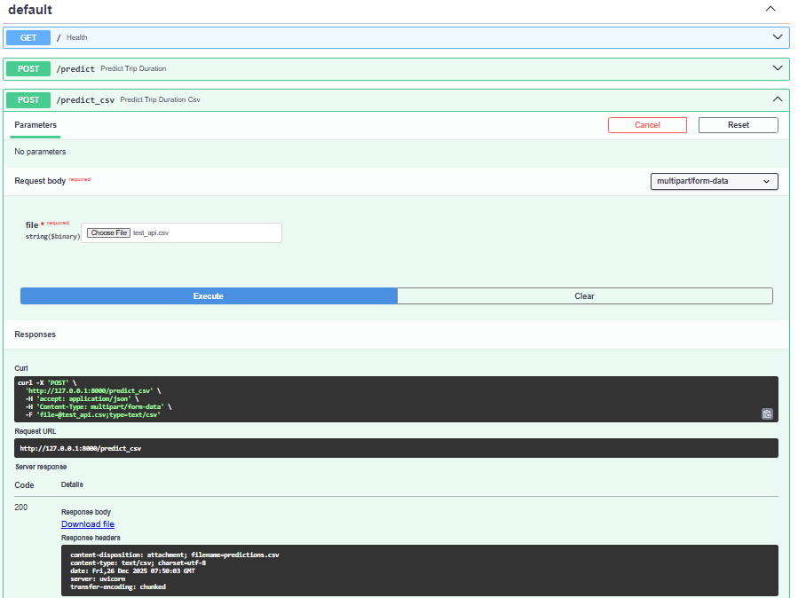
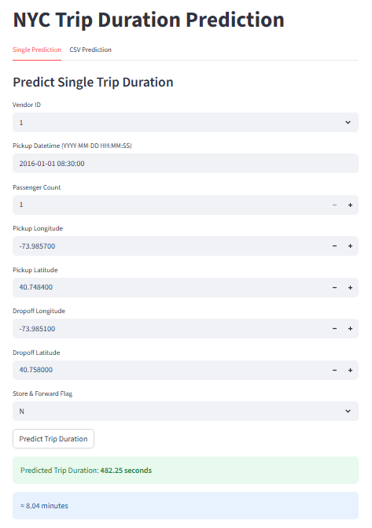
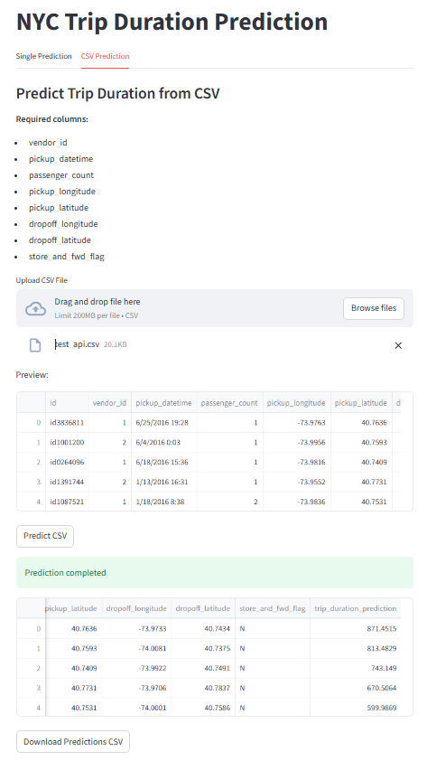

# NYC_Trip_Duration
<p style="text-align:center;">
    
</p>

<h3>

This project predicts the duration of taxi trips in New York City using Machine Learning. The dataset contains 10 input features, with 1 million training samples and 200,000 validation samples.

After performing Exploratory Data Analysis (EDA), Feature Engineering, and Feature Extraction, several machine learning models were trained, including:

Linear Regression

Ridge Regression

Neural Network

XGBoost Regressor


The XGBoost Regressor achieved the best performance with an R² score of 0.76 on the validation set and 0.72 on the test set.

</h3>

### Features
***id*** – A unique identifier for each trip. 

***vendor_id*** – A code indicating the provider associated with the trip record.

***pickup_datetime*** – The date and time when the meter was engaged.

***dropoff_datetime*** – The date and time when the meter was disengaged.

***passenger_count*** – The number of passengers in the vehicle (driver-entered value).

***pickup_longitude*** – The longitude where the meter was engaged.

***pickup_latitude*** – The latitude where the meter was engaged.

***dropoff_longitude*** – The longitude where the meter was disengaged.

***dropoff_latitude*** – The latitude where the meter was disengaged.

***store_and_fwd_flag*** – Indicates whether the trip record was stored in the vehicle's memory before being sent to the vendor because the vehicle had no connection to the server.
Y = Store and Forward
N = Not a Store and Forward trip

***trip_duration*** – Trip duration in seconds.

### From EDA
- The original training dataset contains 10 features.
- The id feature was removed because it does not contribute to prediction.
- The dataset is clean, with only 6 duplicate records and no missing values.
- The target variable initially showed a highly skewed distribution.
- After removing outliers, the target distribution became approximately Gaussian.
- Most trips have 1 or 2 passengers, while passenger counts of 7 and 8 are rare outliers.
- We calculated the Haversine Distance using latitude and longitude coordinates, which showed a strong correlation with the target variable.
- Datetime Analysis
    - Friday and Saturday have the highest number of trips.
    - Most trips occur after 6:00 PM (18:00), likely due to the end of the working day.
    - Other datetime-related features have relatively low importance.

## Project Structure

```text
NYC_Trip_Duration/
├── .venv/
├── src/
│   ├── config/
│   ├── data/
│   ├── enums/
│   ├── Frontend/
│   ├── logs/
│   ├── Model/
│   │   ├── Helper/
│   │   ├── Train/
│   │   └── model.py
│   ├── notebook/
│   ├── outputs/
│   ├── Processing/
│   ├── Testing/
│   ├── utils/
│   ├── .gitignore
│   ├── requirements.txt
│   ├── xgboost.pkl
│   └── __init__.py
├── __init__.py
├── main.py
└── README.md
```

### Installation & Usage

## 1. Clone the Repository

```bash
git clone https://github.com/your_username/NYC_Trip_Duration.git
cd NYC_Trip_Duration
```

---

## 2. Check Python Installation

```bash
python --version
```

or

```bash
python3 --version
```

If Python is not installed, download it from **python.org**.

---

## 3. Check pip Installation

```bash
python -m pip --version
```

If `pip` is not installed:

```bash
curl https://bootstrap.pypa.io/get-pip.py -o get-pip.py

python get-pip.py
```

---

## 4. Create a Virtual Environment

### Linux / macOS

```bash
python3 -m venv .venv
```

### Windows

```bash
python -m venv .venv
```

---

## 5. Activate the Virtual Environment

### Linux / macOS

```bash
source .venv/bin/activate
```

### Windows

```powershell
.\.venv\Scripts\activate
```

---

## 6. Install Dependencies

```bash
cd src
pip install -r requirements.txt
```

---

## 7. Train the Model

```bash
cd src
python -m Model.model
```

---

## 8. Run the Tests

```bash
cd src
python -m Testing.test
```

---

## 9. Run the FastAPI Server

```bash
uvicorn main:app --reload
```

Open your browser and navigate to:

```text
http://127.0.0.1:8000/docs
```
<p style="text-align:center;">
    
</p>


### Predict a Single Example

Open **POST /predict** and send the following JSON:

```json
{
  "vendor_id": 2,
  "pickup_datetime": "2016-06-08 07:36:19",
  "passenger_count": 1,
  "pickup_longitude": -73.985611,
  "pickup_latitude": 40.735943,
  "dropoff_longitude": -73.980331,
  "dropoff_latitude": 40.760468,
  "store_and_fwd_flag": "N"
}
```
- the expected output should show the trip duration prediction
- fast-api screen should show like this
<p style="text-align:center;">
    
</p>

- when open \post\predict_csv and send csv file
- it expected to send csv file with prediction
<p style="text-align:center;">
    
</p>

---

## 10. Run the Streamlit Frontend

```bash
streamlit run src/Frontend/frontend.py
```

Open:

```text
http://localhost:8501
```

The frontend supports:

- Single trip prediction
<p style="text-align:center;">
    
</p>

- CSV file prediction
<p style="text-align:center;">
    
</p>
---

# Evaluation Metrics

The project is evaluated using:

- **R² Score**
- **Mean Squared Error (MSE)**

---

# Results

| Model | R² Score (Validation) | MSE (Validation) |
|-------|----------------------:|-----------------:|
| Linear Regression | 0.600 | 0.226 |
| Ridge Regression | 0.590 | 0.232 |
| Neural Network | 0.586 | 0.234 |
| **XGBoost Regressor** | **0.760** | **0.134** |

The **XGBoost Regressor** achieved the best performance.

## Final Performance

| Dataset | R² Score | MSE |
|---------|---------:|----:|
| Validation | **0.760** | **0.134** |
| Test | **0.725** | **0.174** |
```